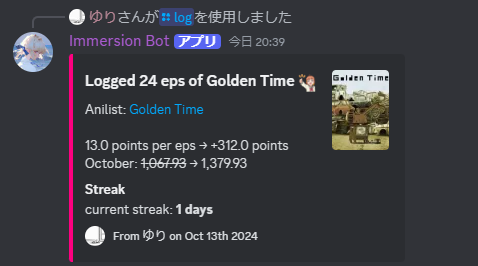
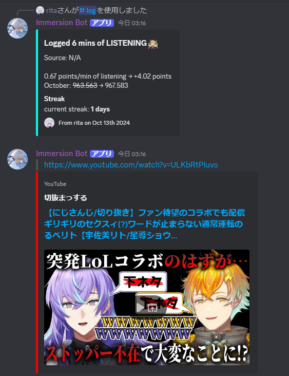
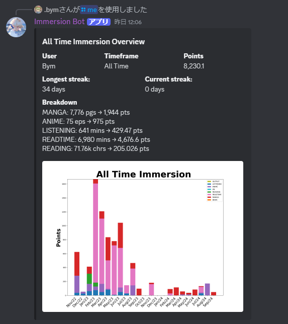
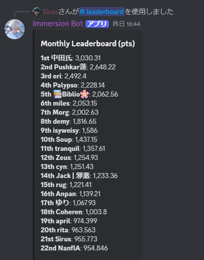

# TheMoeWay Immersion Bot

📢 **New contributors [welcome](contribute.md)!**

## What is the Immersion Bot?
The Immersion bot allows you to keep track of your immersion gains, visualize your immersion progress and allows creating immersion goals for you to hit.

Powerful features that it provides:
- 📝 Logging your learning progress with the ability to use APIs like Anilist and VNDB to get more details for your immersion.
- 🔍 Visualizes your own and others progress with graphs.
- 💪 Compete with everyone in a friendly environment on the leaderboard and get a reward at the end of each month. 
- 🔑 Allows you to export your progress so you can analyze it even better
- ⚙️ Built in log deletion in case you make a mistake with your logs.
- 🙋‍♂️ Streak counts and achievements to motivate you to immerse more.



## Usage Guide

By typing '/' into any discord chat, you will open up the discord slash command menu which will show you all the bots the server has. Now by clicking on the Immersion Bot in that menu, you will be presented with all the commands you can use to track and manage your immersion!

### More important Commands

If you don't know what a command does, you can type /help and selecting the Immersion Bot.

You can log immersion for the following mediums:
- Visual Novels
- Anime
- Manga
- Book
- Readtime
- Listening
- Reading

But you can also earn points by outputting in Japanese. By writing a message in Japanese you will also get points which will count towards your immersion.

```/log [media_type] [amount] Optional(title) Optional(comment)```

Log 10 episodes of the anime Fullmetal Alchemist Brotherhood with the comment "best show ever "

```/log media_type:Anime amount:10 name:5114 comment:best show ever```

Note: You can select the title of an anime in the dropdown menu whene you type in its Japanese name. Or you can type in its Anilist number as a shortcut which you will find in the url. Thats why the name parameter in the example above is a number. 
Using the codes of anime/manga/vns is really useful since they become important when setting a goal with the bot. The demonstration video below makes this easier to understand so feel free to watch it.

**Demonstration:**

https://github.com/user-attachments/assets/90d549db-0f86-4771-ba1e-ae8309670ab0

--------------------------------------------------------------------------------------
Log 2 hours of listening of listening to your oshi

```/log media_type: Listening amount: 2:00 name: listening to oshi```

Log 20 min of listening of youtube

```/log media_type: Listening amount: 20 name: youtube```

Log 1hr and 30 min of readtime of articles

```/log media_type: Readtime amount: 1:30 name: articles```

https://github.com/user-attachments/assets/fc968b94-ce22-461d-8a7a-74ced6a3d8b7

## Immersion Goals
You can set yourself goals to hit when immersing, for example watching 10eps till the end of the day, reading 100k characters till the end of the week, watching 5 eps of Anime daily or listening 70hrs till a specific date you set.

**``/goals``**: This command display your current goals.

**``/set_goal_medium [media_type] [amount] [span] Optional(name)``**
Set a goal of watching 30 eps of any anime till the end of today

```/set_goal_medium media_type:anime amount:30 span:DAY```
Set a goal of watching 26 eps of  watching Neon Genesis Evangelion till 20th May 2024

```/set_goal_medium media_type:anime amount:26 span:20-05-2024 name:30```

Note: Only logs where you explicitly log Neon Genesis Evangelion by having it selected from the dropdown menu or through the anilist code (such that the source link will pop up in the log message) will count towards that goal.
Logging something like this now:

```/log media_type:anime amount:1 name:Neon Genesis Evangelion```
will not count towards the goal set above

```/set_goal_medium media_type:anime amount:26 span:20-05-2024 name:30```
meaning the name of the goal/log is case-sensitive, you have to be exact.
But setting a goal like this, without select the title from the dropdown menu in name and without the anilist code but just typing it raw out in the name parameter

```/set_goal_medium media_type:anime amount:26 span:20-05-2024 name:Neon Genesis Evangelion```
and logging it like this 

```/log media_type:anime amount:1 name:Neon Genesis Evangelion```
will count towards it.

**Demonstration:**

https://github.com/user-attachments/assets/ca22510e-9e6b-4833-83b8-87d31d35fd06

## Viewing logs
You can view logs/leaderboards of the following timeframes:
- **Month**
Selects all the logs from the current month.
- **Week**
Selects all the logs from the current week.
- **Year**
 Selects all the logs from the current year.
- **All time**
Selects all the logs there are.
- **Day**
Selects all the logs from today
-** custom timeframe [year-month-day-year-month-day]**
Selects all the logs from the specified timeframe.

### Usage

Some commands, like ``/me``, ``/leaderboard`` ..., allow you to further narrow down the logs which are going to be selected by specifying a media type, such that only logs of a certain media type are considered or of a specifc name.

You can view your logs with the following commands:

```/me [timeframe (default=MONTH)] [media_type] [name]```

Shows your immersion breakdown. 
Example:
- You can select a preset timeframe like MONTH, WEEK, ALL TIME etc. or a custom timeframe you can set like 2023-04-24-2024-05-01. 
- You can narrow the logs further down by selecting a media type, so if you select ANIME then only your anime logs will show up.
- You can also enter a name, so for example an anilist code like 20755 (for the anime Assassination Classroom) and it will only show those logs where you logged the anime Assassination Classroom.

You can conbine the filters how you want, allowing you to view logs of any time. The same goes for the following commands.

-----------------------------------------------------------------------------------
```/user [user] [timeframe (default=MONTH)] [media_type] [name]```

Different to the ``/me`` command, which shows you only your logs, the ``/user`` command shows you the logs of any user.

----------------------------------------------------------------------------------
```/leaderboard [timeframe (default=MONTH)] [media_type] [name]```

Shows the leaderboard. You can narrow down the selected logs the same way as the previous commands. 

----------------------------------------------------------------------------------
```/logs [user] [timeframe (default=DAY)] [media_type] [name]```

Shows the logs of a user. You can narrow down the selected logs the same way as the previous commands.

----------------------------------------------------------------------------------
```/export [timeframe (default=MONTH)] [media_type]```

Exports your logs in a cvs file. You can narrow down the selected logs the same way as the previous commands.

## Installation

Before you can install and run the bot, make sure you have the following:
1. Python 3.9.0
   You can download Python from [here](https://www.python.org/downloads/release/python-390/).
2. Discord Developer Account
   You need a Discord account and a registered bot in the Discord Developer Portal.
3. Git (to clone this  repository)
   Download Git from [here](https://git-scm.com/).
4. A text editor
   You can use any text editor (e.g., VC code, Sublime Text, Atom).

## Steps to Install
### 1. Clone the Repository
First, clone the bot repository to your local machine.
```
git clone https://github.com/themoeway/Immersionbot.git
cd Immersionbot
```
### 2. Create a Virtual Environment (Optional but Recommended)
It is recommended to create a virtual environment to manage dependencies cleanly.
```
python -m venv venv
source venv/bin/activate   # For Linux/MacOS
# or
venv\Scripts\activate      # For Windows
```
### 3. Install Dependencies
Use pip to install the required dependencies specified in the requirements.txt file.
```
pip install -r requirements.txt
```
### 4. Create a Discord Bot Application
  1. Go to the Discord Developer Portal and log in.
  2. Click New Application and give it a name.
  3. In the Bot section, create a new bot and copy its Token.
  4. Tick `Presence Intent`, `Server Members Intent` and `Message Content Intent`.
  5. Under OAuth2 > URL Generator, enable `bot` and `applications.commands` scopes. Assign administrator permissions and copy the link and add the bot to your server.
  6. Paste the token at the bottom of the `launch_bot.py` file.
### 6. Run the Bot
To start the bot, run the following command:
```
python launch_bot.py
```
### 7. Verify the Bot is Working
Once the bot is running, you can test its functionality by interacting with it on your Discord server.

## Contributing

🚀 **Dip your toes into contributing by looking at issues with the label [good first issue](https://github.com/yomidevs/yomitan/issues?q=is%3Aissue+is%3Aopen+label%3A%22good+first+issue%22).**

Since this is a distributed effort, we **highly welcome new contributors**! Feel free to browse the [issue tracker]([https://github.com/yomidevs/yomitan/issues](https://github.com/themoeway/Immersionbot/issues)), and read our [contributing guidelines](contribute.md).

If you're looking to code, please let us know what you plan on working on before submitting a Pull Request. This gives the core maintainers an opportunity to provide feedback early on before you dive too deep. You can do this by opening a Github Issue with the proposal.


